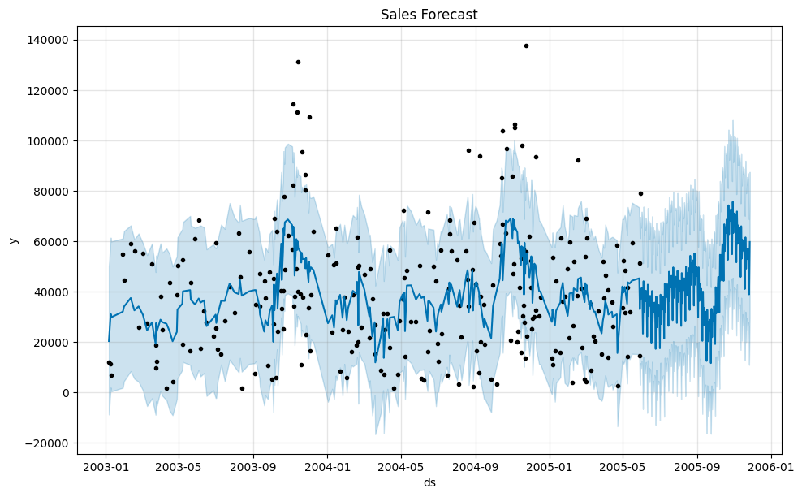
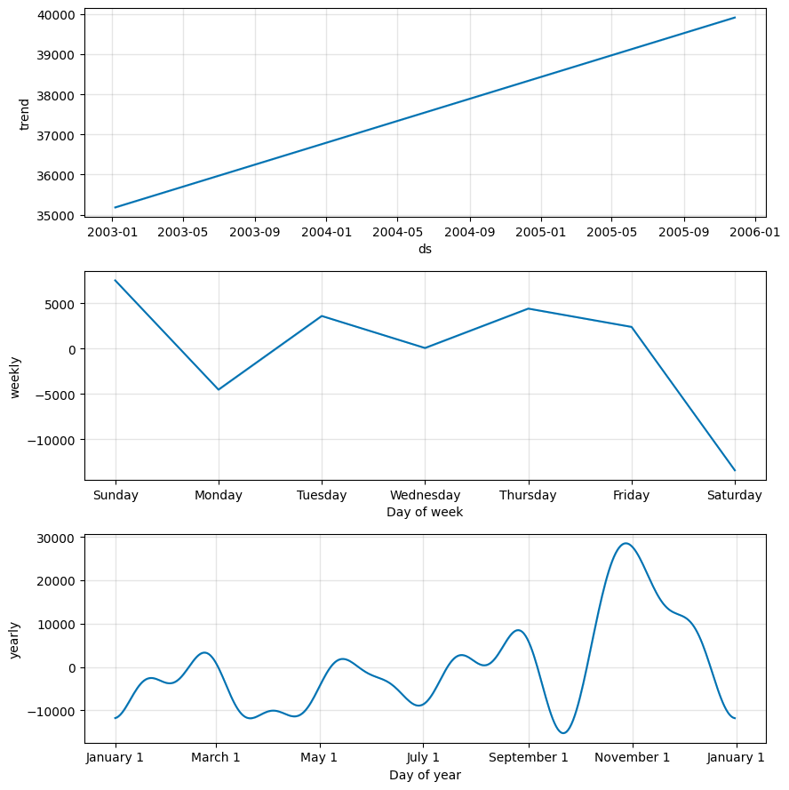

# FUTURE_ML_01 - Sales Forecasting for Retail Business

> A complete end-to-end time-series sales forecasting project built as part of the **Future ML** program.  
> Uses historical retail transaction data and the **Prophet** forecasting model to predict future sales.

---

## Table of Contents

- [Project Overview](#project-overview)
- [Tech Stack](#tech-stack)
- [Dataset](#dataset)
- [Project Workflow](#project-workflow)
- [Model Details](#model-details)
- [Results](#results)
- [Visualizations](#visualizations)
- [Repository Structure](#repository-structure)
- [How to Run](#how-to-run)
- [Quick Reuse Guide](#quick-reuse-guide)
- [Limitations](#limitations)
- [Future Improvements](#future-improvements)
- [Author](#author)
- [Acknowledgements](#acknowledgements)

---

## Project Overview

Retail teams need forward-looking sales estimates to support planning, inventory management, and business decisions. This project builds a baseline forecasting workflow — from raw order records all the way to future sales predictions.

The notebook covers:

- Data loading, cleaning, and preprocessing
- Time-series preparation from transaction-level records
- Exploratory Data Analysis (EDA) and trend visualization
- Forecasting with **Prophet**
- Model evaluation using **MAE** and **RMSE**
- Export of forecasted values for downstream reporting

---

## Tech Stack

| Tool | Purpose |
|---|---|
| Python | Core programming language |
| pandas | Data loading, cleaning, and transformation |
| matplotlib | Visualizations and trend plots |
| seaborn | Correlation heatmap |
| prophet | Time-series forecasting model |
| scikit-learn | Evaluation metrics (MAE, RMSE) |
| Jupyter Notebook | Interactive development environment |

---

## Dataset

- **Source:** [Sample Sales Data — Kaggle](https://www.kaggle.com/datasets/kyanyoga/sample-sales-data)
- **File in repo:** `sales_data_sample.csv`
- **Description:** Historical retail sales transaction records including order numbers, sales figures, product lines, dates, and more.
- **Key fields used:**
  - `ORDERDATE` — transaction date
  - `SALES` — revenue per transaction

---

## Project Workflow

### 1. Data Loading
Load the sales CSV into a pandas DataFrame for inspection and processing.

### 2. Data Preprocessing
- Parse `ORDERDATE` to datetime format
- Drop duplicates and check for missing values
- Group transaction-level data into daily sales totals
- Rename columns to Prophet schema: `ds` (date) and `y` (sales)

### 3. Exploratory Data Analysis (EDA)
- Plot sales trends over time
- Generate a correlation heatmap on numeric features
- Visualize a 12-period moving average over raw sales

### 4. Train / Test Split
Chronological 80/20 split to preserve time ordering:
```python
split_index = int(len(sales_data) * 0.8)
train = sales_data.iloc[:split_index]
test  = sales_data.iloc[split_index:]
```

### 5. Model Building
- Fit **Prophet** on the training set
- Generate future dates (180 days ahead) for forecasting
- Separately predict on test dates for evaluation

### 6. Model Evaluation
- Compute **MAE** and **RMSE** on real test set predictions
- Plot **Actual vs Predicted Sales** using real model output

### 7. Forecast Export
- Export forecast to `forecasted_sales.csv`
- Columns: `ds`, `yhat`, `yhat_lower`, `yhat_upper`

---

## Model Details

Prophet is fit in two passes:

**Full Forecast Mode** (all data → 6 months ahead)
```python
model = Prophet()
model.fit(sales_data)
future   = model.make_future_dataframe(periods=180)
forecast = model.predict(future)
```

**Evaluation Mode** (train only → predict on test dates)
```python
model = Prophet()
model.fit(train)
forecast_test = model.predict(test[['ds']])
```

---

## Results

| Metric | Value |
|---|---|
| MAE (Mean Absolute Error) | **19,815.74** |
| RMSE (Root Mean Square Error) | **23,827.22** |

---

## Visualizations

### Sales Over Time


### Correlation Heatmap


### Moving Average Plot


### Sales Forecast (6 Months Ahead)


### Seasonality Components


### Actual vs Predicted (Test Set)


> All images are saved in the `images/` folder.

---

## Repository Structure

```
FUTURE_ML_01/
├── sales_forecasting.ipynb     # Main Jupyter Notebook
├── sales_data_sample.csv       # Raw dataset
├── forecasted_sales.csv        # Exported forecast output
├── images/                     # Saved visualization plots
└── README.md
```

---

## How to Run

**1. Clone the repository:**
```bash
git clone https://github.com/yourusername/FUTURE_ML_01.git
cd FUTURE_ML_01
```

**2. Install dependencies:**
```bash
pip install pandas matplotlib seaborn prophet scikit-learn jupyter
```

**3. Launch Jupyter and open the notebook:**
```bash
jupyter notebook sales_forecasting.ipynb
```

**4.** Run cells in order to reproduce preprocessing, EDA, training, evaluation, and forecasts.

---

## Quick Reuse Guide

To apply this workflow to updated or new data:

1. Keep the same schema prep (`ORDERDATE` → `ds`, `SALES` → `y`)
2. Re-run the training cells in `sales_forecasting.ipynb`
3. Adjust the forecast horizon by changing `periods` in `make_future_dataframe()`
4. Re-export `forecasted_sales.csv` for downstream use

---

## Limitations

- Uses a single target signal (`SALES`) with no exogenous variables
- No holiday or promotional event regressors included
- Baseline model only — no hyperparameter tuning performed
- Moving average EDA is on raw transaction-level data, not the daily-aggregated series used for modeling
- The residuals analysis in the notebook currently uses simulated data and does not reflect real model output

---

## Future Improvements

- Fix residuals analysis to use real model predictions instead of simulated data
- Add holiday/event regressors for better seasonality modeling
- Compare Prophet with ARIMA, XGBoost, and LSTM baselines
- Implement time-series cross-validation for robustness
- Hyperparameter tuning (changepoint scale, seasonality mode, etc.)

---

## Author

**Adnan Rahman Sayeem**  
Connect on [LinkedIn](https://www.linkedin.com/in/adnan-rahman-sayeem/)

---

## Acknowledgements

- [Kaggle](https://www.kaggle.com/) for the sample sales dataset
- The **Future ML** program for the project framework
- Prophet (Meta) for the open-source forecasting library
