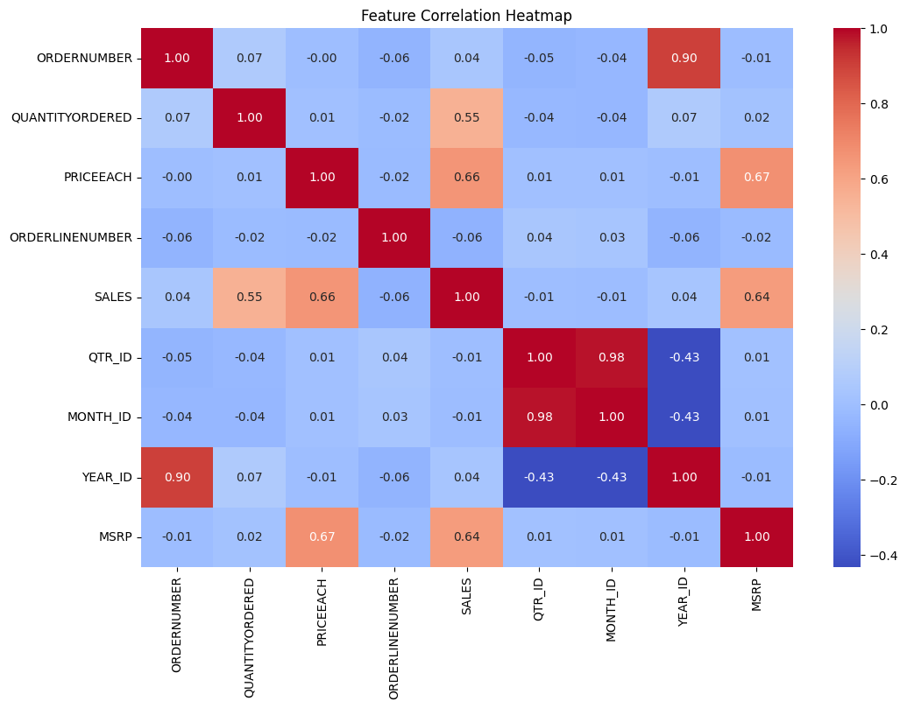
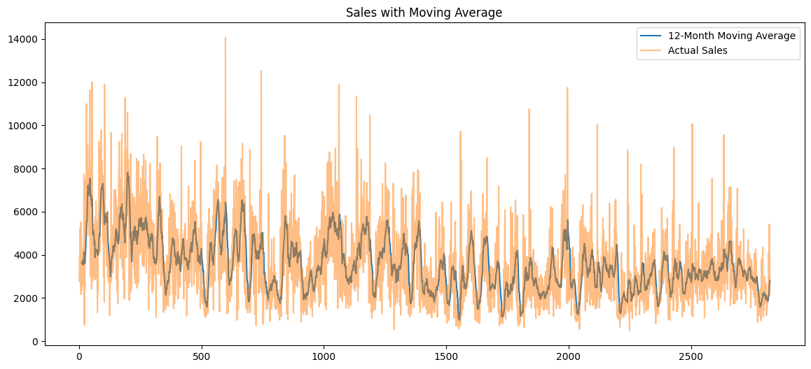
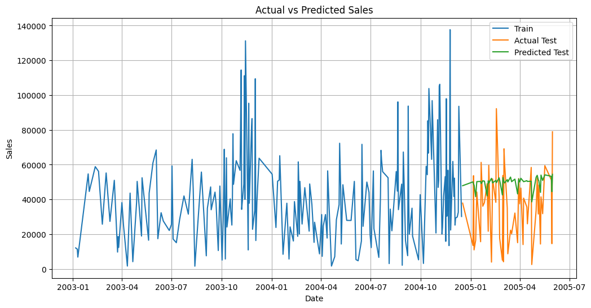
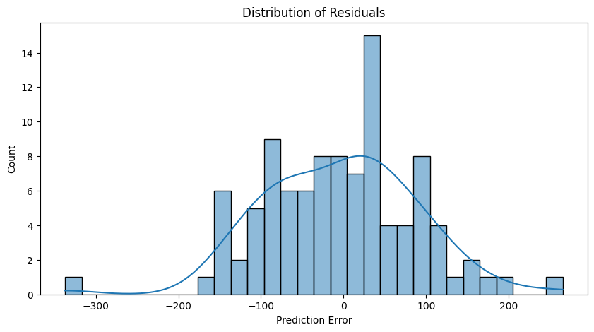

# FUTURE_ML_01 - Sales Forecasting for Retail Business

## Project Overview
This project is part of the **Future ML** program, focusing on **sales forecasting** using machine learning models and data analysis techniques.  
The objective is to build a regression model that can predict future sales based on historical sales transaction data.

I used **Python**, **Pandas**, **Scikit-learn**, **Matplotlib**, and **Seaborn** to preprocess the data, build the model, perform evaluation, and visualize insights.

---

## Tools and Libraries
- Python
- Pandas
- Scikit-learn (for machine learning models and evaluation metrics)
- Matplotlib (for visualizations)
- Seaborn (for advanced plots and heatmaps)

---

## Dataset
- Source: [Sample Sales Data from Kaggle](https://www.kaggle.com/datasets/kyanyoga/sample-sales-data)
- Description: The dataset contains historical sales transaction data including order numbers, sales figures, product lines, dates, and more.

---

## Project Workflow
1. **Data Loading:**  
   Load the sales data into a Pandas DataFrame.

2. **Data Preprocessing:**  
   - Handle missing values and duplicates.
   - Convert dates to datetime objects.
   - Feature engineering from date columns (Month, Year, Quarter).
   - Select relevant features for modeling.

3. **Exploratory Data Analysis (EDA):**  
   - Plot sales trends over time.
   - Generate a correlation matrix heatmap.
   - Visualize moving averages to capture trends and seasonality.

4. **Model Building:**  
   - Split the data into training and testing sets.
   - Train a **Linear Regression** model to predict sales.

5. **Model Evaluation:**  
   - Evaluate model performance using **MAE** (Mean Absolute Error) and **RMSE** (Root Mean Squared Error).
   - Plot **Actual vs Predicted Sales**.
   - Analyze **Residuals Distribution** and **Residuals vs Predicted** plots.

6. **Visualization:**  
   - Feature Correlation Heatmap
   - Sales Moving Average Plot
   - Actual vs Predicted Sales Comparison
   - Residual Analysis

---

## Results
- Built a machine learning model capable of predicting sales based on historical patterns.
- Visualized sales trends, feature relationships, and residual behaviors.
- Achieved reasonable forecasting performance evaluated by MAE and RMSE metrics.

---

## Sample Visualizations

Here are some sample outputs from the Exploratory Data Analysis (EDA):

### Sales Over Time


### Correlation Heatmap


### Moving Average Plot


### Actual vs Predicted Sales


### Residuals Distribution


*Note: Images are saved inside the `images/` folder.*

---


## Folder Structure
```
/FUTURE_ML_01
│
├── images/
├── README.md
├── sales_forecasting.ipynb   # Jupyter Notebook with all code and outputs
├── sample-sales-data.csv     # Dataset used
└── forecasted_sales.csv      # (Optional) Output of forecasted sales
```

---

## How to Run the Project
1. Clone the repository:
   ```bash
   git clone https://github.com/yourusername/FUTURE_ML_01.git
   ```
2. Install required libraries:
   ```bash
   pip install pandas matplotlib prophet scikit-learn
   ```
3. Open the Jupyter Notebook and run each cell step-by-step.

---

## Future Improvements
- Use more complex models (e.g., ARIMA, LSTM) for better accuracy.
- Incorporate additional features (like promotions, holidays) into the model.
- Tune hyperparameters in Prophet for improved forecasting.

---

## Author
- [Adnan Rahman Sayeem]
- Connect with me on [LinkedIn](https://www.linkedin.com/in/adnan-rahman-sayeem/)

---

## Acknowledgements
- Thanks to [Kaggle](https://www.kaggle.com/) for providing the sample sales dataset.
- This project is a part of the **Future ML** initiative.
